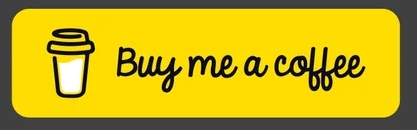

# The web framework for static content-driven websites

fusion.ssg seamlessly fuses together familiar web-based technologies to propel your static website development to a whole new level.

## Current Stable Version

v1.3.0.

## Create resilient static websites

- Philosophy - The most useful tools are those that fully embrace the functionality that directly reflects their purpose and ignores all others.
- Minimalistic - fusion.ssg is built from the ground up to be just that, making it quick to learn for anyone who already has experience with HTML, JavaScript and CSS.
- Productivity - No complicated tooling and configuration to stand in the way of your creativity, and the project generator gets you up and creating quickly.
- Fast - Capable of generating hundreds of pages in under a second.

## Features

- Zero initial project configuration.
- DOMless and serverless execution.
- .ts, .tsx and .jsx compilation.
- .tsx and .jsx sand-boxed execution.
- Bulk HTML document generation via collection components.
- package.json scripts for development and release builds.
- CLI one-off development and release builds.
- Base URL support for sites hosted in sub folders.
- Works in progress ignored during release builds.
- Works in progress reporting during release builds (v1.2.0).
- Blog posts with multiple categories and tags
- Blog posts metadata exposed as simple tokens (v1.2.0).
- Beautified HTML and CSS documents.
- Optional cache busting for release builds using --cache-bust (v1.2.0).
- Conditional includes based on build strategy (v1.2.0).

## Installation

Full installation instructions can be found at [fusionssg.com](https://fusionssg.com/docs/v1/installation/).

## Project Development

The project is written in ` TypeScript` (no excuses, _it just works beautifully_) and runs on `Node`.

## Project Scope

The project's scope is limited to generating robust and resilient HTML documents and websites and requires no knowledge of other front-end frameworks. This keeps the scope of the project focused and prevents feature creep.

## Versioning

This project uses [Semantic Versioning](https://semver.org/).

## What Still Remains To Be Done

- fusion.ssg deserves an awesome logo. If you are a graphic artist 🎨, we would love ❤️  your contribution to this project and we we'd be thrilled to give you well-deserved, prominent attribution! Please reply via [issues](https://github.com/4awpawz/fusion.ssg/issues/51).

## Long Term Goals

- Seek RFC.
- Accept pull requests when procedures and policies are in place to govern the process.

## Community

For help, discussion about best practices, or any other conversation that would benefit from being searchable:

[Discuss _fusion.ssg _on Github](https://github.com/4awpawz/fusion.ssg/discussions)

For casual conversation with others about using _fusion.ssg_:

[Discuss _fusion.ssg on Twitter and other social media.](https://twitter.com).

## Show Your Appreciation

Please 👀 watch and leave us a 🌟 star. :)
